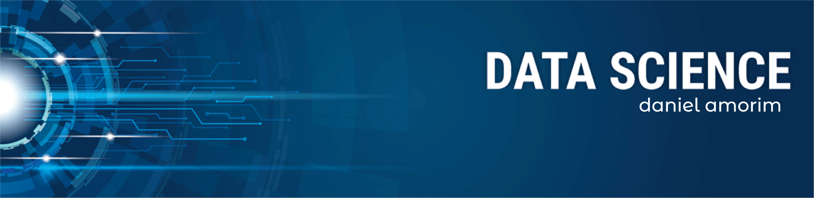

   

  

# Daniel Amorim
*Data Scientist student*

Data scientist Rookie. I aim to make projects in the area, expand my knowledge doing so and refine my critical-thinking and problem solving skills in the process.

Currently studying media development(along with graphic and game design) at Univesidade Federal do Ceará, in the Sistemas e mídias digitais course.

**Background in:** Python, Machine Learning, Game and graphic design.

**Links:**
* [LinkedIn](https://www.linkedin.com/in/daniel-bessa-081a08206/)
* [Medium](https://www.medium.com)

## Projetos:
Veja os tutoriais publicados do Sigmoidal:

* **--:** 
* **--:** 
* **Data Science: Investigando o naufrágio do Titanic:** 

---

